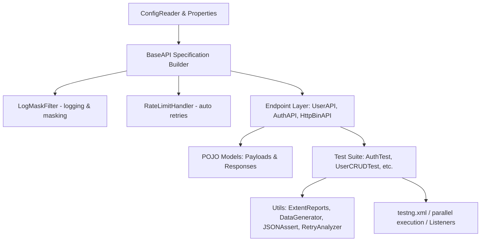

# Project Implementation Guide: RestAssured TestNG API Automation Framework

Welcome to the implementation guide for the **RestAssured TestNG API Automation Framework**. This document provides a detailed walkthrough of the structural design patterns, configurations, utility classes, and validation strategies implemented in this repository.

---

## 1. Framework Architecture & Design Patterns

The project follows a modular, decoupled framework architecture separating configuration, API endpoints, utilities, and tests:



Key patterns used in the framework:
*   **Singleton Pattern (Bill Pugh method):** The [ConfigReader](file:///e:/Learning/antigravity-projects/restassured-testng-app/src/main/java/com/framework/config/ConfigReader.java) is instantiated using a thread-safe, lazy-loaded static inner helper class.
*   **Request Specification Builder:** The [BaseAPI](file:///e:/Learning/antigravity-projects/restassured-testng-app/src/main/java/com/framework/api/BaseAPI.java) class handles common headers, timeouts, and request/response filters dynamically based on the target API.
*   **Decoupled Endpoint Layer:** Endpoint classes (like [UserAPI](file:///e:/Learning/antigravity-projects/restassured-testng-app/src/main/java/com/framework/endpoints/UserAPI.java)) isolate endpoints, path parameters, and request verbs from the actual test classes.
*   **Annotation-Driven Test Lifecycle:** Utilizes TestNG annotations, custom listeners, retry analyzers, and parallel execution constraints to build a enterprise-grade runner.

---

## 2. Configuration & Properties Layer

### [FrameworkConstants.java](file:///e:/Learning/antigravity-projects/restassured-testng-app/src/main/java/com/framework/config/FrameworkConstants.java)
Defines project-wide constants including folder paths (resources, schemas, reports, test data) and default fallback values:
*   `PROJECT_PATH`: Standard project root dynamic extraction.
*   `ENV_PROPERTIES_PATH_TEMPLATE`: Template path format for loading environments `env.%s.properties`.
*   `REPORTS_PATH`: Path for reporting index output (`target/reports/index.html`).

### [ConfigReader.java](file:///e:/Learning/antigravity-projects/restassured-testng-app/src/main/java/com/framework/config/ConfigReader.java)
Dynamically loads variables depending on the current environment:
1.  Checks system property `-Denv`. If unset, defaults to `qa`.
2.  Loads properties from:
    *   [env.qa.properties](file:///e:/Learning/antigravity-projects/restassured-testng-app/src/test/resources/env.qa.properties)
    *   [env.uat.properties](file:///e:/Learning/antigravity-projects/restassured-testng-app/src/test/resources/env.uat.properties)
    *   [env.prod.properties](file:///e:/Learning/antigravity-projects/restassured-testng-app/src/test/resources/env.prod.properties)
3.  Supplies endpoints, connection/socket timeouts, and environment info to RestAssured specs.

---

## 3. Core REST Assured Client & Interceptors

### [BaseAPI.java](file:///e:/Learning/antigravity-projects/restassured-testng-app/src/main/java/com/framework/api/BaseAPI.java)
Exposes builders to create thread-safe `RequestSpecification` objects:
*   Includes JSON `ContentType` headers.
*   Maps connection and socket timeouts dynamically using values loaded from configuration properties.
*   Bypasses SSL/TLS certificates via `.setRelaxedHTTPSValidation()`.
*   Appends customized filters for logging and handling API limits automatically.

### [LogMaskFilter.java](file:///e:/Learning/antigravity-projects/restassured-testng-app/src/main/java/com/framework/api/LogMaskFilter.java)
An interceptor implementing RestAssured's `Filter` interface:
*   Formats requests and responses into readable console blocks.
*   Saves execution logs directly into the **ExtentReports** dashboard.
*   **Security compliance:** Automatically masks sensitive request headers (e.g. `Authorization`, `Token`) and sensitive payload fields (using regex-based mapping for fields like `password`, `secret`, `pwd`).

### [RateLimitHandler.java](file:///e:/Learning/antigravity-projects/restassured-testng-app/src/main/java/com/framework/api/RateLimitHandler.java)
Automatically intercepts responses with status **HTTP 429 (Too Many Requests)**:
*   Inspects the `Retry-After` response header.
*   If found, sleeps the executing thread for the specified seconds; otherwise, falls back to a default exponential/fixed backoff of 1000ms.
*   Retries the request to ensure resilience against API rate-limiting.

---

## 4. Endpoints & POJO Layer

Endpoints are modeled as helper services returning REST Assured `Response` objects, which decouple tests from endpoint URI strings:
*   [AuthAPI.java](file:///e:/Learning/antigravity-projects/restassured-testng-app/src/main/java/com/framework/endpoints/AuthAPI.java): Handles authentication POST endpoints (`/api/login`, etc.).
*   [UserAPI.java](file:///e:/Learning/antigravity-projects/restassured-testng-app/src/main/java/com/framework/endpoints/UserAPI.java): Implements full CRUD verbs (`GET`, `POST`, `PUT`, `DELETE` to `/users`).
*   [HttpBinAPI.java](file:///e:/Learning/antigravity-projects/restassured-testng-app/src/main/java/com/framework/endpoints/HttpBinAPI.java): Interacts with HttpBin for advanced edge-case validations (multipart file uploads, streaming downloads, simulated rate-limiting responses).

Payloads and responses utilize Jackson databindings inside Lombok models:
*   [LoginPayload.java](file:///e:/Learning/antigravity-projects/restassured-testng-app/src/main/java/com/framework/pojo/LoginPayload.java) & [LoginResponse.java](file:///e:/Learning/antigravity-projects/restassured-testng-app/src/main/java/com/framework/pojo/LoginResponse.java)
*   [UserPayload.java](file:///e:/Learning/antigravity-projects/restassured-testng-app/src/main/java/com/framework/pojo/UserPayload.java) & [UserResponse.java](file:///e:/Learning/antigravity-projects/restassured-testng-app/src/main/java/com/framework/pojo/UserResponse.java)

---

## 5. Utilities Library

*   [DataGenerator.java](file:///e:/Learning/antigravity-projects/restassured-testng-app/src/main/java/com/framework/utils/DataGenerator.java): Wraps JavaFaker to construct realistic random names, job titles, email addresses, and passwords for dynamic data injection.
*   [ExtentReportManager.java](file:///e:/Learning/antigravity-projects/restassured-testng-app/src/main/java/com/framework/utils/ExtentReportManager.java): Provides thread-safe ExtentReports logging using a `ThreadLocal` wrapper. This ensures clean, un-entangled reports even during parallel test execution.
*   [FrameworkListener.java](file:///e:/Learning/antigravity-projects/restassured-testng-app/src/main/java/com/framework/utils/FrameworkListener.java): Implements TestNG suite, test, and method listeners. Automatically controls ExtentReport setup, test creation, and status mappings.
*   [RetryAnalyzer.java](file:///e:/Learning/antigravity-projects/restassured-testng-app/src/main/java/com/framework/utils/RetryAnalyzer.java) & [AnnotationTransformer.java](file:///e:/Learning/antigravity-projects/restassured-testng-app/src/main/java/com/framework/utils/AnnotationTransformer.java): Automatically retries any failed test up to 2 times. The transformer hooks into TestNG's listener cycle to inject `RetryAnalyzer` dynamically across all test classes without manual decoration.
*   [JSONCompareUtil.java](file:///e:/Learning/antigravity-projects/restassured-testng-app/src/main/java/com/framework/utils/JSONCompareUtil.java): Wraps SkyScreamer's `JSONAssert` library to assert full JSON objects or files. Allows toggling between `STRICT` (matches array ordering and strict element equality) and `LENIENT` validation modes.
*   [JSONReader.java](file:///e:/Learning/antigravity-projects/restassured-testng-app/src/main/java/com/framework/utils/JSONReader.java): Uses Jackson `ObjectMapper` to read external JSON files into Java collections (List of Maps) for data-driven testing.

---

## 6. Comprehensive Test Suite

### [AuthTest.java](file:///e:/Learning/antigravity-projects/restassured-testng-app/src/test/java/com/framework/tests/AuthTest.java)
*   Logs in, parses the JSON response to extract a session token, and passes it to subsequent tests using TestNG's `dependsOnMethods`.
*   Tests both **Bearer Token** authentication headers and standard **Basic Authentication** (`given().auth().basic(...)`).

### [UserCRUDTest.java](file:///e:/Learning/antigravity-projects/restassured-testng-app/src/test/java/com/framework/tests/UserCRUDTest.java)
*   Validates a standard CRUD pipeline flow: POST user, GET details, PUT updates, and DELETE cleanup.
*   Utilizes JavaFaker for dynamic data creation and AssertJ fluent assertions to evaluate status codes and payload responses.

### [DataDrivenUserTest.java](file:///e:/Learning/antigravity-projects/restassured-testng-app/src/test/java/com/framework/tests/DataDrivenUserTest.java)
*   Implements a custom TestNG `@DataProvider` reading inputs from [testdata.json](file:///e:/Learning/antigravity-projects/restassured-testng-app/src/test/resources/testdata.json).
*   Runs concurrent API validation scenarios across multiple mock parameters automatically.

### [ComplexJsonValidationTest.java](file:///e:/Learning/antigravity-projects/restassured-testng-app/src/test/java/com/framework/tests/advanced/ComplexJsonValidationTest.java)
*   **Groovy GPath Queries:** Leverages GPath expressions to query JSON responses (e.g. `collect { it.email }`, `find { it.name == 'Ervin' }`, `findAll { it.id > 8 }`, `max { it.id }`).
*   **Expected Template Assertions:** Compares actual responses against the reference [expected-user.json](file:///e:/Learning/antigravity-projects/restassured-testng-app/src/test/resources/expected-user.json) template using `JSONCompareUtil`.
*   **JSON Schema Validation:** Verifies API contract schema compliance using RestAssured's `JsonSchemaValidator` matching against [user-schema.json](file:///e:/Learning/antigravity-projects/restassured-testng-app/src/test/resources/schemas/user-schema.json).
*   **Assertion Styles:** Highlights differences between standard RestAssured fluent chaining and decoupled TestNG `SoftAssert`.

### [FileUploadDownloadTest.java](file:///e:/Learning/antigravity-projects/restassured-testng-app/src/test/java/com/framework/tests/advanced/FileUploadDownloadTest.java)
*   **Multipart Uploads:** Creates a temporary file on-the-fly and uploads it via `.multiPart(...)` with `multipart/form-data` content-type.
*   **Binary Downloads:** Downloads a stream of bytes and verifies the file size by converting the response to a byte array (`response.asByteArray()`).

### [RateLimitAndSlaTest.java](file:///e:/Learning/antigravity-projects/restassured-testng-app/src/test/java/com/framework/tests/advanced/RateLimitAndSlaTest.java)
*   **SLA (Service Level Agreement):** Asserts that an API responds within a specific response time threshold (`.time(lessThan(3000L), TimeUnit.MILLISECONDS)`).
*   **Rate-Limit Simulation:** Validates the automated `RateLimitHandler` retry capabilities by calling a simulated rate-limiting endpoint.

---

## 7. Execution & Command Line Configuration

### [testng.xml](file:///e:/Learning/antigravity-projects/restassured-testng-app/src/test/resources/testng.xml)
Configures execution listeners, active groups, parallel modes (`classes`), and thread count limits:
```xml
<suite name="RestAssured Framework Parallel Test Suite" parallel="classes" thread-count="3" verbose="1">
    <listeners>
        <listener class-name="com.framework.utils.FrameworkListener" />
        <listener class-name="com.framework.utils.AnnotationTransformer" />
    </listeners>
...
```

### Running Tests from CLI
You can execute the entire test suite via Maven, specifying different target environments using the `-Denv` system flag:

```bash
# Run in the QA environment (Default)
mvn clean test -Denv=qa

# Run in the UAT environment
mvn clean test -Denv=uat

# Run in the Production environment
mvn clean test -Denv=prod
```
